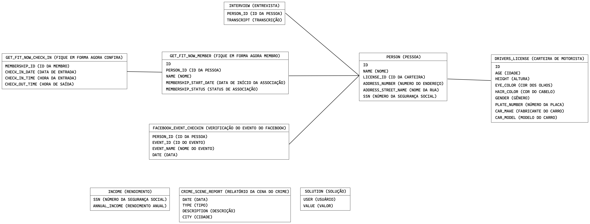

# Boas-vindas a SQL Trybe City

### Nossa cidade precisa de sua ajuda, tevevmos um assassinato em SQL Trybe City e precisamos de pessoas experientes em SQL para resolverem esse crime intrigante.

## Vamos aos fatos! :mag_right:
Um crime ocorreu e o detetive precisa de sua ajuda. O detetive deu a você o relatório da cena do crime, mas de alguma forma você o perdeu. :sweat_smile: Você lembra vagamente que o crime foi um foi um homicídio **ocorrido em 15 de janeiro de 2018** e que ocorreu em **Trybe City**. Comece recuperando o **relatório da cena do crime** correspondente do banco de dados dos departamento de polícia.

## Explorando a estrutura do banco de dados
Usuários experientes de SQL geralmente podem usar consultas de banco de dados para inferir a estrutura de um banco de dados. Mas cada sistema de banco de dados tem maneiras diferentes de gerenciar essas informações.

Use este comando SQL para encontrar as tabelas o banco.

~~~sql
SHOW TABLES;
~~~

Além de conhecer os nomes das tabelas, você precisa saber como cada tabela está estruturada. A maneira como isso funciona também depende de qual tecnologia de banco de dados você usa.

Use este comando SQL para encontrar a estrutura da tabela.

~~~sql
SELECT *
FROM INFORMATION_SCHEMA.COLUMNS 
WHERE TABLE_SCHEMA = 'trybecity' AND TABLE_NAME ='crime_scene_report';
~~~

## Diagrama

Para auxiliar nas buscar temos o diagrama do banco de dados.

# Agora é com você!

Use seu conhecimento do esquema do banco de dados e dos comandos SQL para descobrir quem cometeu o assassinato. Boa sorte!